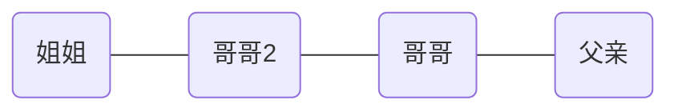
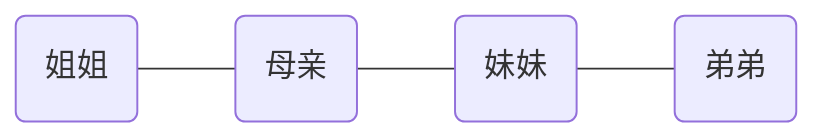
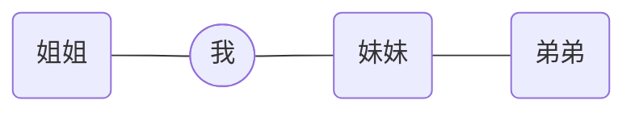

# template

```mermaid
graph TD
    YY(爷爷)-->F(父亲)
    NN(奶奶)-->F(父亲)

    YG(外公)-->M(母亲)
    YP(外婆)-->M(母亲)

    F(父亲)-->W([我])
    M(母亲)-->W([我])  
```

## 父亲的兄弟姐妹

```mermaid
flowchart LR
    JJ(姐姐)---GG2(哥哥2)---GG(哥哥)---F(父亲)
```

## 母亲的兄弟姐妹

```mermaid
flowchart LR
    JJ(姐姐)---M(母亲)---MM(妹妹)---DD(弟弟)
```

## 我的兄弟姐妹

```mermaid
flowchart LR
    JJ(姐姐)---W([我])---MM(妹妹)---DD(弟弟)
```
